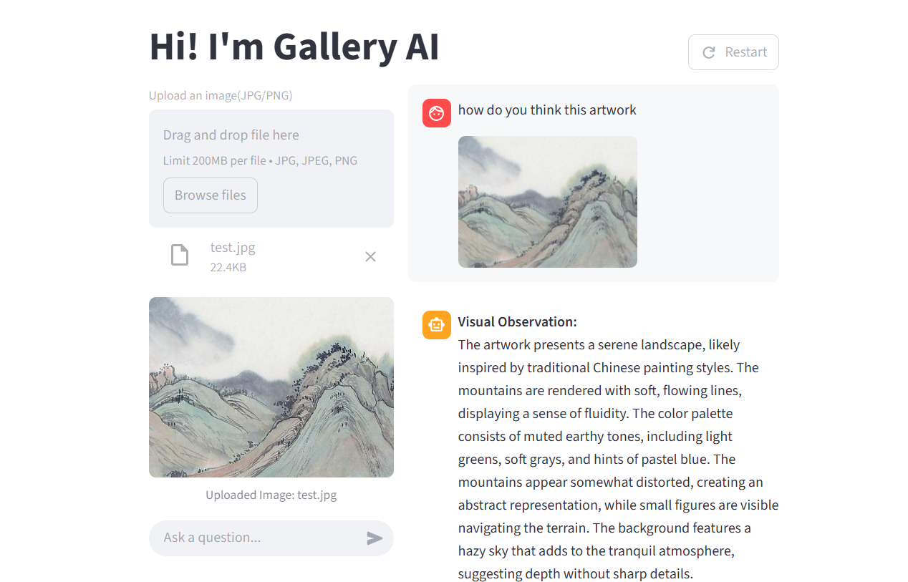
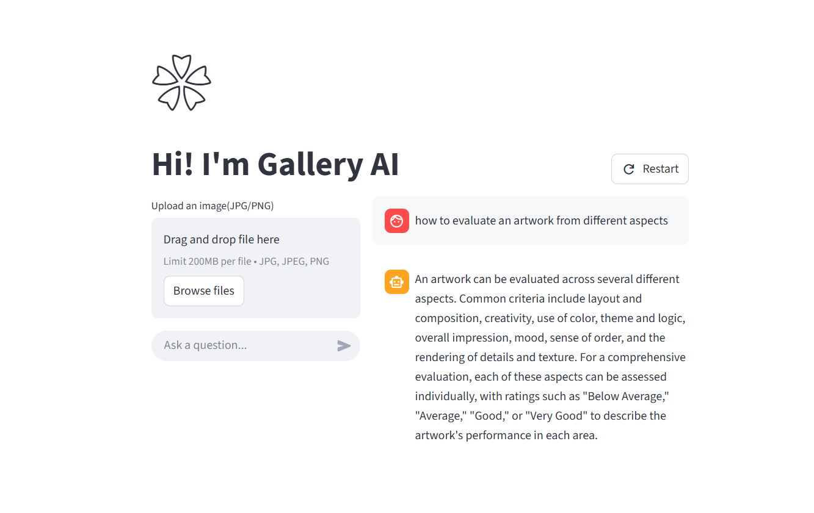

# 🌼Gallery AI

本项目是基于大模型和知识图谱构造的艺术绘画分析平台




## Introduction

Gallery AI基于大模型的预备知识和专业艺术评论数据库，能对艺术作品做出专业分析和指导。具有以下功能：

1. 纯文本问答

   

2. 多模态问答：上传作品图片和指令，得到详细的分析结果。具体内容见 [Gallery AI multimodal.pdf](Gallery AI multimodal.pdf) 

## Realization

### Data

我们的数据集来自[ APDDv2](https://arxiv.org/abs/2411.08545)，一个专门针对美学绘画和素描的**审美评论**数据集（共计10023张图片），它定义了十个艺术赏析的维度，总体的数据信息参考如下：


为了将其转为知识图谱以便于模型能更好的学习到如何进行艺术评论，还需要将数据集字段进一步细粒度划分：

- comment拆成针对每个审美维度的reason，大模型辅助拆分
- 作品分类进一步划分
- 将审美维度的数值分数改为等级制，便于大模型区分

成功将原始 [APDD.csv](csv/APDD.csv) 进化为 [APDD_enriched_split_text.csv](csv/APDD_enriched_split_text.csv) 

### Knowledge Graph

我们选择 **neo4j** 作为图数据库，图结构如下：

```
nodes:
 - Artwork
 - Artstyle
 - Category
 - Subject
 - Dimension
 
relationships:
 - :BELONGS_TO_CATEGORY
 - :BELONGS_TO_STYLE
 - :BELONGS_TO_SUBJECT
 - :HAS_LEVEL
```

可直接供导入的csv文件在  [csv](csv) 目录下

### LanguageOnly QA

 **langchain** 对llm+neo4j的使用有很好的支持，所以我们采用了他的框架

1. 与neo4j建立连接
2. 配置大模型API
3. 调用 **GraphCypherQAChain** 得到回答：首先大模型会根据指令和图谱结构写出Cypher语句（neo4j的查询语言），然后根据查询结果输出回答

### Multi-modal QA

对于用户上传作品请求评论的情景，我们的工作流是：在数据库中查找类似的作品——调用GraphCypherQAChain查询这些作品的得分情况——将用户的输入与类似作品信息统一传递给大模型生成回答

1. 处理目标图片，生成embedding：为了实现更快的查询速度，我们事先用 **CLIP** 模型为数据库所有的作品生成embedding并存入节点信息里。这样用户上传图片后，只需要转换一张图片的编码，就能在数据库里快速查询
2. 相似度检索： **Neo4jVector** 支持图数据库的向量查询，选择只对作品的embedding属性进行查询，返回作品文件名，可通过参数k改变返回数量
3. 将所有图片转为base64编码字符串，因为大模型API支持网络url和base64两种图片方式，我们目前在本地运行
4. 对这些节点调用 **GraphCypherQAChain** 查询到维度得分和评论信息，大模型负责结构化返回这些信息
5. 构建最终prompt，调用vllm解答

## Use

1. 安装环境

   ```
   git clone https://github.com/359jxf/Gallery-AI-Your-Art-Analysis-Assistant.git
   cd Gallery-AI-Your-Art-Analysis-Assistant
   conda create -n gallery
   conda activate gallery
   pip install -r requirements.txt
   ```

2. 下载 **neo4j** 并构建图谱（上一节），修改程序中graph配置信息。其中Artwork.csv 需自己创建，包含的属性有 `id`,`filename`,`embedding`,`:LABEL`

3. 配置大模型API并存入 .env 文件夹，可根据实际情况修改模型

4. 多模态问答会加载CLIP模型，请配置好加速器或镜像网站，或下载到本地

5. 多模态问答需要数据库中图片，请下载好APDDv2数据集，放在images文件夹下

6. 运行以下命令开启网页🙌

   ```
   streamlit run frontend.py
   ```

   